# Autonomous-Insurance-Claims-AI
🚀 **Insurance Claims AI**

## 📌 Overview

Insurance Claims AI is a web-based application built using ASP.NET Core Web App (MVC) that automates the extraction and processing of insurance claim data from **PDF and TXT documents**.

The system reads uploaded files, extracts data using iText 7 (for PDFs) or direct text parsing (for TXT files), and uses Gemini AI to convert it into structured JSON with intelligent routing decisions.


---

## 🎯 Features

* 📄 Upload insurance claim files (**PDF & TXT supported**)

* 🔍 Extract data from fillable PDFs (AcroForms)

* 📝 Support for plain text (.txt) documents

* 🔄 Fallback text extraction for non-fillable PDFs

* 🤖 AI-based structured data extraction

* ⚡ Smart claim routing:

  * Fast-track
  * Manual review
  * Investigation
  * Specialist queue

* 🖥️ Clean and simple UI


   ---
🛠️**Tech Stack**
  
- ASP.NET Core Web App (MVC)
  
- C#
  
- iText 7 (PDF processing)
  
- Gemini API (AI extraction)
  
- Newtonsoft.Json

---

## 📸 Application UI

### 🏠 Home Page

<p align="center">
  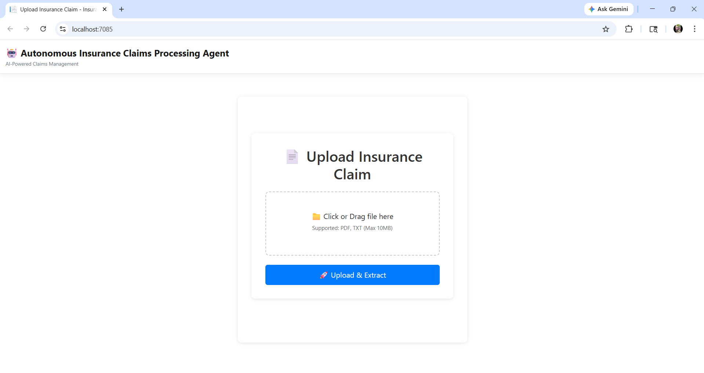
</p>

---

### ⚡ Fast Track Flow

#### 1️⃣ Overall View

<p align="center">
  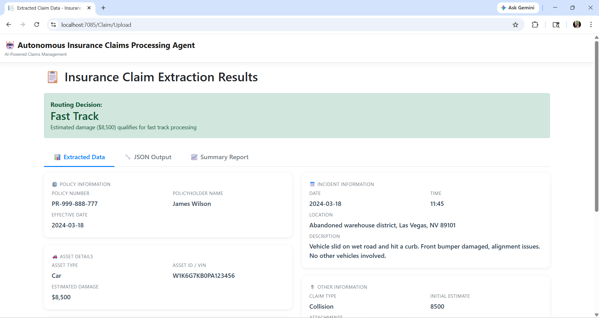
</p>

#### 2️⃣ JSON Structure

<p align="center">
  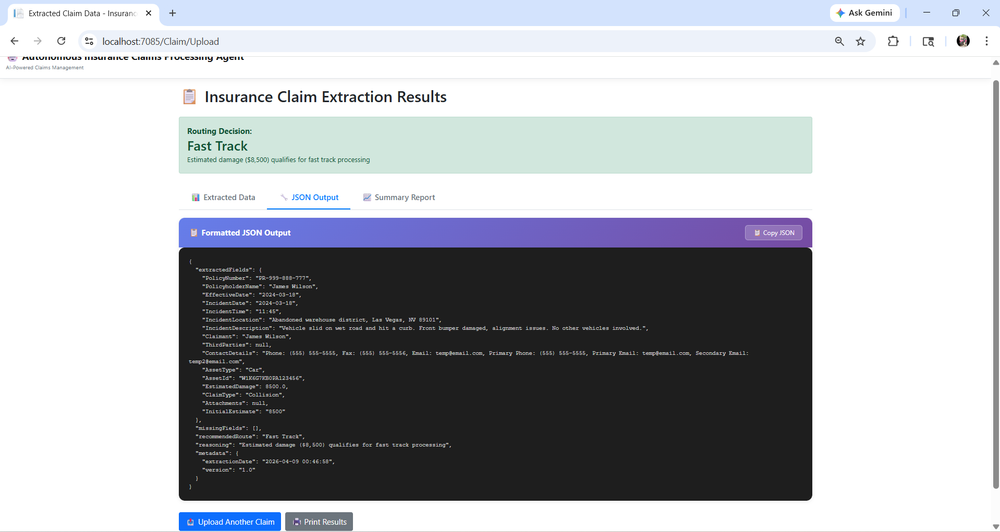
</p>

#### 3️⃣ Summary Result

<p align="center">
  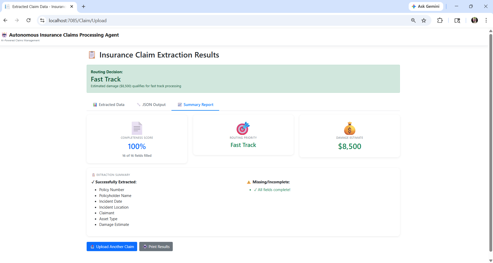
</p>

---

### ⚠️ Manual Review Flow

#### 1️⃣ Overall View

<p align="center">
  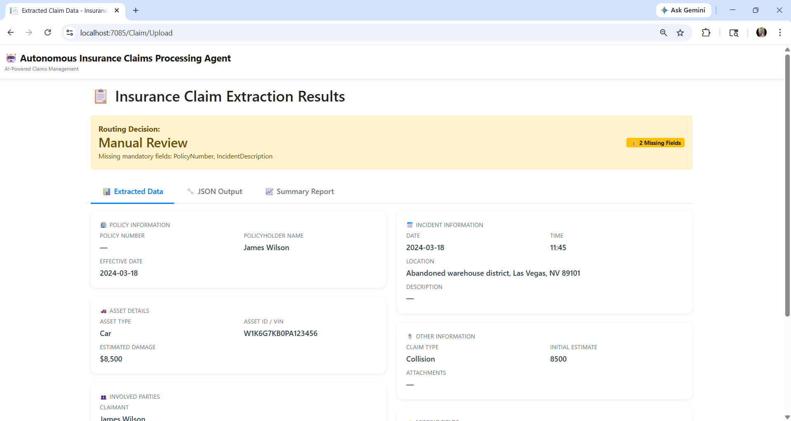
</p>

#### 2️⃣ JSON Structure

<p align="center">
  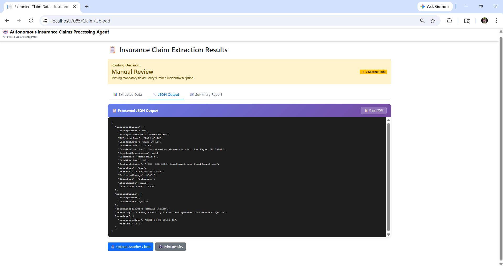
</p>

#### 3️⃣ Summary Result

<p align="center">
  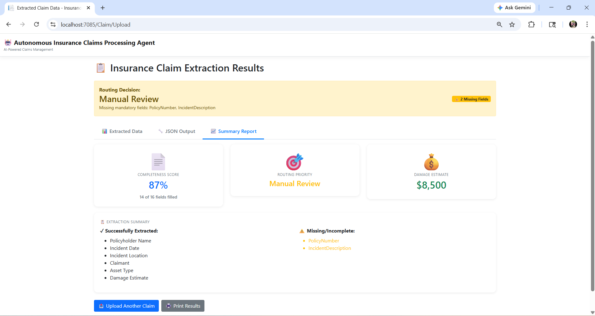
</p>

---

### 🚨 Fraud Detection Flow

#### 1️⃣ Overall View

<p align="center">
  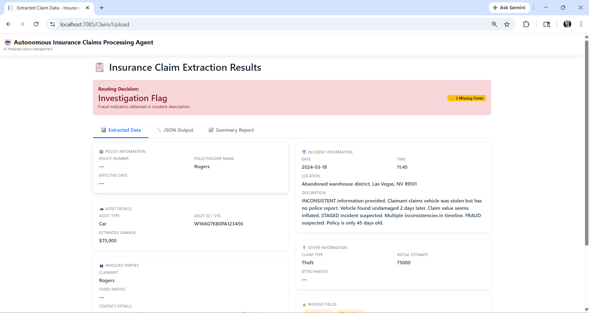
</p>

#### 2️⃣ JSON Structure

<p align="center">
  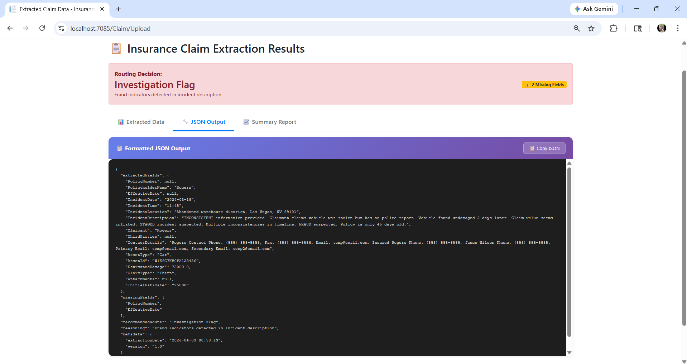
</p>

#### 3️⃣ Summary Result

<p align="center">
  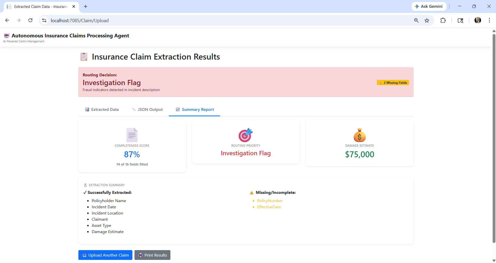
</p>

---

### 🏥 Injury / Specialist Flow

#### 1️⃣ Overall View

<p align="center">
  
</p>

#### 2️⃣ JSON Structure

<p align="center">
  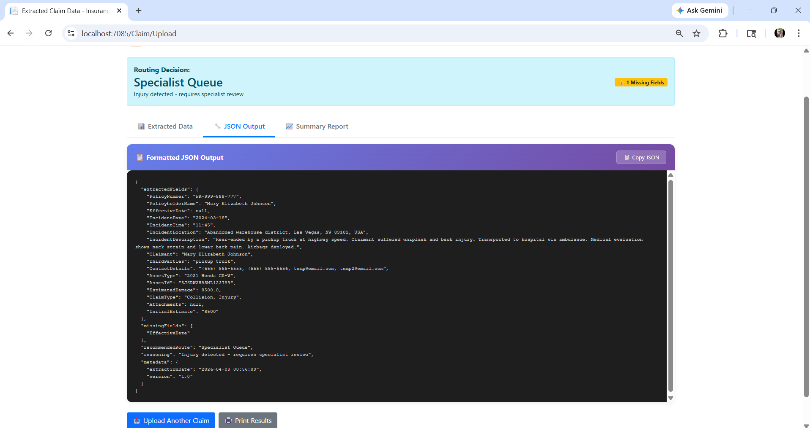
</p>

#### 3️⃣ Summary Result

<p align="center">
  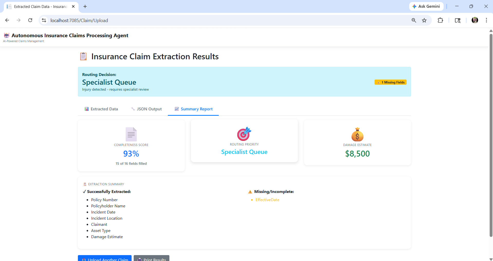
</p>

---

🔄 Workflow

Upload PDF

↓

Extract Data (iText 7)

↓

Send to Gemini AI

↓

Get structured JSON

↓

Apply routing logic

↓

Display result

---
  
## 📂 Project Structure

```text
InsuranceClaimsAI/
│
├── Controllers/
│   ├── ClaimController.cs
│   
│
├── Models/
│   ├── ClaimResult.cs
│   └── ErrorViewModel.cs
│
├── Services/
│   ├── AiExtractionService.cs
│   └── PdfService.cs
│
├── Views/
│   ├── Claim/
│   │   ├── Index.cshtml
│   │   └── Result.cshtml
│   ├── Home/
│   └── Shared/
│
├── wwwroot/
│   ├── css/
│   ├── js/
│   ├── lib/
│   └── uploads/
│
├── appsettings.json
└── Program.cs
```

---

## ⚙️ Setup Instructions

### 1. Clone the repository

```bash
git clone https://github.com/pnithinsanjay10/InsuranceClaimsAI.git
cd InsuranceClaimsAI
```

### 2. Restore dependencies

```
dotnet restore
```

### 3. Add API Key

Open `appsettings.json` and add:

```json
{
  "GeminiApiKey": "YOUR_API_KEY"
}
```

### 4. Run the project

```bash
dotnet run
```

### 5. Open in browser

```
https://localhost:xxxx/Claim
```

---

## 📊 Sample Output

```json
{
  "extractedFields": {
    "PolicyNumber": "POL12345",
    "PolicyholderName": "John Doe",
    "Date": "2026-04-01",
    "Location": "New York",
    "DamageEstimate": 15000
  },
  "missingFields": [],
  "recommendedRoute": "Fast-track",
  "reasoning": "Low claim amount with complete data"
}
```

---

## 🧠 Routing Logic

| Condition      | Route         |
| -------------- | ------------- |
| Damage < 25000 | Fast-track    |
| Missing fields | Manual review |
| Fraud keywords | Investigation |
| Injury claims  | Specialist    |

---

## ⚠️ Notes

* Works best with **fillable PDFs (AcroForms)**
* Supports normal PDFs via text extraction
* Supports **TXT files** for direct text processing

---

## 👨‍💻 Author

**Nithin Sanjay**

---

## 📜 License

This project is for educational purposes.


  
